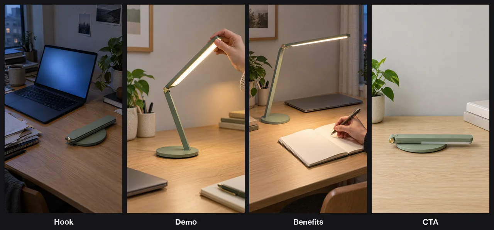

# Viral Video Remake Skill

[English](./README.md) | 简体中文

把一条跑出来的短视频拆成钩子、中段和转化引导，再把这套结构套到你自己的选题上，出分镜表、分镜图和口播，交付一条竖屏短片，或分段素材加字幕和带时间码的剪辑清单，在 Claude Code、Codex 或 OpenClaw 里直接完成。

> [!IMPORTANT]
> 生成需要 [Beatra](https://beatra.ai) 账号并消耗积分，安装本身不收费。

| 问题 | 回答 |
| --- | --- |
| **能做什么** | 粘一个视频链接，或者把文件截图交给它：把一条跑出来的短视频拆成钩子、中段和转化引导，再把这套结构套到你自己的选题上，出分镜表、分镜图、口播——镜头简单、时长在单条模型上限内就交付一条由开场画面动起来的竖屏短片，卡点多或时长超限就按分段交付素材，配一条完整口播音轨、字幕和带时间码的剪辑清单。 |
| **运行要求** | Python 3.10+，以及能加载 `SKILL.md` 的 Agent |
| **费用** | 安装免费。每次生成消耗 Beatra 账号积分，只有你明确要求这次生成或批准确认卡后才会付费。 |
| **支持的 Agent** | Claude Code、Codex、OpenClaw |

<p align="center"></p>

*按一个假设的“先讲痛点”短视频结构，为虚构的折叠台灯 Brightfold 重做的四张 9:16 分镜帧（钩子、演示、卖点、行动号召）。由 Beatra AI 生成。*

| Skill | Entry point | Version |
| --- | --- | --- |
| [`viral-video-teardown-remake`](skills/viral-video-teardown-remake) | [SKILL.md](skills/viral-video-teardown-remake/SKILL.md) | 0.3.1 |

本仓库由 [beatra-ai/beatra-skills](https://github.com/beatra-ai/beatra-skills/tree/main/skills/viral-video-teardown-remake) 自动发布，问题请到那里反馈。

## 安装

使用 [`skills`](https://skills.sh) CLI：

```bash
npx skills add beatra-ai/viral-video-remake-skill
```

使用 GitHub CLI：

```bash
gh skill install beatra-ai/viral-video-remake-skill viral-video-teardown-remake
```

也可以克隆本仓库，把 `skills/viral-video-teardown-remake` 复制到 `~/.claude/skills/`（Claude Code）、`~/.agents/skills/`（Codex）或 `~/.openclaw/skills/`（OpenClaw）。

或者把下面这段话发给你的 Agent：

```text
从 https://github.com/beatra-ai/viral-video-remake-skill 安装 viral-video-teardown-remake skill（目录 skills/viral-video-teardown-remake），然后按它的 SKILL.md 连接我的 Beatra 账号。
```

## 效果示例

<p align="center"></p>

[▶ 观看完整视频（MP4）](assets/full-1.mp4)

*虚构台灯 Brightfold 的 6 秒竖屏重做短片：钩子帧动起来，配四句旁白，依次讲钩子、演示、卖点和行动号召。由 Beatra AI 生成。*

提示词：

```text
Evening on a cramped desk. The folded sage-green desk lamp in the foreground slowly unfolds on its own: its single flat arm rises from the round base, the long flat light bar lifts open at the small brass hinge, and the light bar switches on with a warm white glow that brightens the desk. Slow gentle camera push-in toward the lamp. The laptop, papers, mug and plant stay still. Smooth, realistic product-video motion.
```

## 你能得到什么

- **拆的是结构，不是表面** — 按秒切出钩子、中段各功能段和转化引导，并判定它属于六类脚本结构里的哪一类。
- **说清到底靠什么跑起来** — 把结构层、内容层、呈现层分开归因，让你清楚哪一层才是真正能搬走的那层。
- **终点是能开拍的素材，不是一份报告** — 画面与口播分开写的分镜表、按静帧交付的分镜图、口播音轨，以及一条由开场画面动起来的竖屏短片，或者在卡点多、时长超出单条模型上限时改为按分段交付的素材，配好字幕和带时间码的剪辑清单。

## 适用场景

- **拆同行刚爆的那条** — 弄清对手为什么起量，用同一套结构做出你自己的版本。
- **把参考视频变成可复用格式** — 把收藏夹里的样片提炼成能反复套用的内容形状。
- **对标账号的爆款重做一遍** — 保留已被验证的节奏与段落顺序，把每一句主张换成你自己的。

## 常见问题

### 我需要准备什么？

一条参考短视频，加一句你这条要做什么。参考可以是一个视频链接、视频文件、关键画面截图、复制来的文案，或者你自己口述每一段发生了什么。

### 拆解到底给我看什么？

带秒级时间点的分段表、这条视频属于哪一类脚本结构、按贡献度排序的爆款归因，以及钩子强度、信息密度、节奏控制、主体呈现、情绪曲线、转化引导六个维度的评分，最后指出它哪里不够好、你的复刻可以在哪里赢它。

### 最后我拿到什么？

一份画面和口播分开写的分镜表、你选定段落的分镜图，以及自选音色的口播音轨。参考视频镜头简单、时长在单条模型上限内，就交付一条由开场画面动起来、配好整段口播的 9:16 竖屏短片，其余段落的分镜图按静帧交付，方便你剪进自己的版本；参考视频卡点更多，或时长超过单条模型上限，就改为交付每一段的分镜素材、同一条完整口播音轨、字幕，以及带时间码的剪辑清单，供你在自己的编辑软件里拼接。

## 更新

安装后的 skill 每天最多检查一次新版本，替换前先校验官方归档，任何一步失败都不会动你已安装的版本。
随时可以关闭，见 skill 内的 `references/automatic-updates-and-safety.md`。

## 许可证

[MIT-0](LICENSE)：可自由使用、修改和再分发，包括商用，无需署名；与这些 skill 在 ClawHub 上的条款一致。
